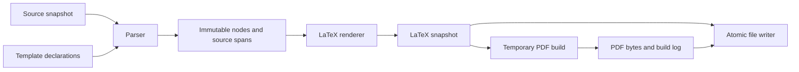

# Architecture

NoteX is an installable Python library and CLI with bundled LaTeX definitions. Packaging uses a `src/` layout and `pyproject.toml`, following the [Python Packaging User Guide](https://packaging.python.org/en/latest/tutorials/packaging-projects/). Its conversion runtime uses only the Python standard library; PDF compilation additionally requires an external LaTeX installation.

## Data flow

`models.py` holds `Text`, `Style`, `Math`, `MathExpression`, `LineBreak`, `Box`, `SourceSpan`, and `ParseError`. `Box` represents a top-level expression, including headings, display equations, and plain note paragraphs. Spans use half-open character offsets into the original source. Error payloads carry zero-based offsets and one-based lines and columns.

`templates.py` discovers box environments and explicitly declared heading/style macros. It rejects missing or duplicate definitions and excludes ordinary TeX comments when checking commands. It is a declaration reader for the project's template conventions, not a complete TeX interpreter. Importing the installed library performs no template file reads; templates load when conversion is requested.

`parser.py` reads the original input with one shared cursor. It consumes escapes once, produces nested style nodes, enforces matching delimiters, and limits recursive depth to 64. Compiled regular expressions match at the cursor without copying the remaining source. Whitespace is removed only from the outer edges of each expression.

`math_parser.py` receives the original source and cursor when a `math{...}` region or `equation(...)` expression begins. It tokenizes only that region and uses precedence parsing to build typed math nodes. Division, powers, subscripts, unary signs, implicit multiplication, functions, and equation rows have explicit grammar rules. Arity and calculus variable/order checks report original source locations. Both recursive parsing and tree height are bounded; long left-associative chains cannot create an unbounded rendering recursion. There is no Python execution or raw LaTeX passthrough.

`math_renderer.py` translates validated math nodes through a fixed command vocabulary. It groups fractions and scripts, renders supported functions, translates Greek names/symbols, and wraps output in inline or display math delimiters. Multiple rows use an `aligned` environment. Math typesetting performs no symbolic calculation. It also rejects malformed atom/function values in programmatically supplied nodes.

`renderer.py` consumes parsed nodes. It escapes literal text exactly once, validates expression names against the selected definitions, and delegates math nodes to the math renderer. A `note` becomes ordinary paragraph text, a heading becomes a template macro call, a display equation becomes a math block, and another expression becomes a LaTeX environment. The generated article loads `amsmath` and `amssymb` and imports template files by absolute path.

`service.py` exposes `convert_source()` for an in-memory snapshot. It has no artifact-writing side effects and rejects heading/box name collisions. Atomic publication writes a sibling temporary file, flushes it, preserves existing file permissions, and replaces the target. The CLI validates path and inode aliases before writing. Atomicity applies per file; publishing two files is not an all-or-nothing transaction.

`compiler.py` receives a complete LaTeX snapshot and returns PDF bytes and its log. It runs one `pdflatex` process with a finite timeout, no shell, no shell escape, and no interactive input. It uses a temporary directory and does not modify user artifacts. The temporary directory limits artifact pollution; it is not a security sandbox for arbitrary templates. The current one-pass compiler supports the supplied notes; future cross-reference features require a multi-pass strategy.

`cli.py` owns argument handling, input reads, path protection, publication, and user-facing results. It optionally compiles a PDF before publishing either artifact, so a parse/build failure preserves the previous successful output. Human-readable output is the default; `--json` enables editor-friendly conversion diagnostics. `convert.py` re-exports the original API and runs the CLI directly from a checkout.

## Extension boundaries

Live preview should call `convert_source()` and `compile_pdf()` rather than launch the CLI on every keystroke. Revision management, debounce timing, cancellation, caching, and HTTP belong in new preview modules. Parser tests do not need a browser or TeX process. A preview server must never require the parser to know about sessions, transport connections, or UI state.

Source spans enable highlighting and future source maps. They do not yet map generated LaTeX compiler errors back to source notes. Python offsets and columns count Unicode code points; a browser editor using UTF-16 indices must translate them for characters outside the basic multilingual plane.
